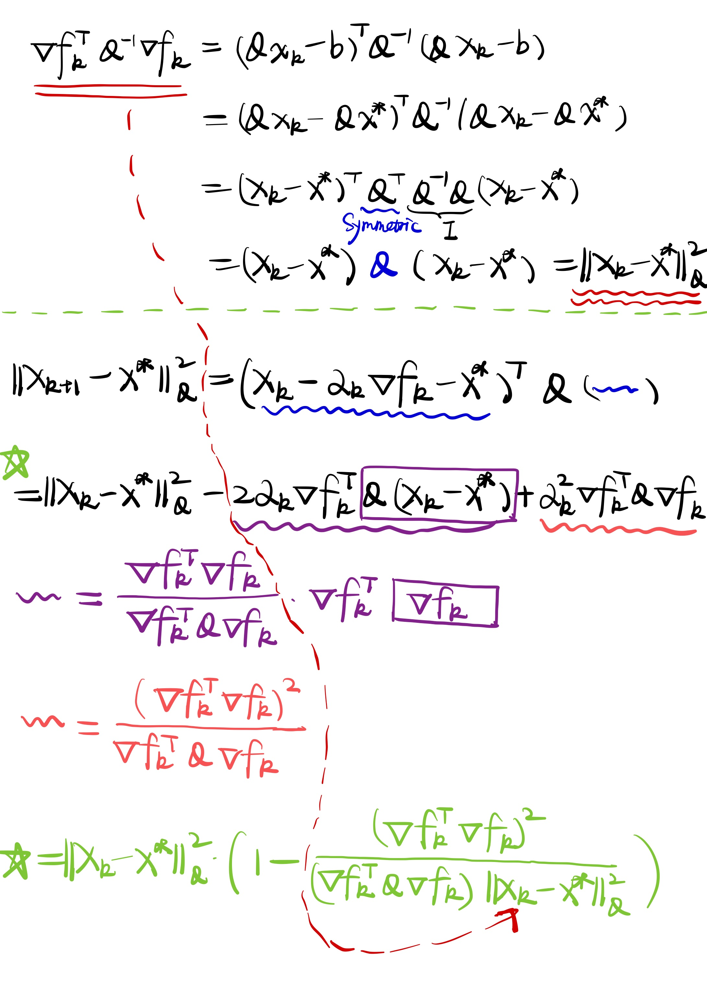

### Preface

The blogs are solely used to record my study of optimization methods and, as such, will not be as comprehensive or detailed as the referenced textbook,[Numerical Optimization][1]. Additionally, as a computer science major student, I aim to keep the content practical rather than abstract.

#### Main idea

Given a continuous differentiable function $f: \mathbb{R}^{n} \rightarrow \mathbb{R}$ and assume we are now at point $x_{k}$, since we want to minimize the function value, we aim to find a new point $x_{k+1}$, s.t., $f(x_{k+1}) < f(x_{k})$. But how to find this new point? Line search tells us to walk along the direction $p_{k} \in \mathbb{R}^{n}$ for a small step $\alpha_{k} \in \mathbb{R}$. Therefore, the iteration of line search is given by

$$
\begin{aligned}
    x_{k+1} = x_{k} + \alpha_{k}p_{k}.
\end{aligned}
$$

Another question arises, how to determine the search direction $p_{k}$. According to Taylor's Theorem,

$$
\begin{aligned}
    f(x + \alpha p) = f(x) + \alpha \nabla f(x)^{\top}p + \frac{1}{2}\left(\alpha p\right)^{\top}\nabla^{2} f(x + t\alpha p)\left(\alpha p\right), \text{for some } t \in [0, 1].
\end{aligned}
$$

Since the quadratic term ($\frac{1}{2}\alpha^{2}p^{\top}\nabla^{2} f(x + t\alpha p)p$) about $\alpha$ approaches $0$ faster than the linear term ($o(\alpha)$), we may focus on the linear term when $\alpha$ is sufficiently small. To decrease the function value,

$$
\nabla f(x)^{\top}p < 0
$$

is sufficient. And such directions $p$ are so-called descent direction. There're some popular choices of $p$, such as $-\nabla f(x)$ used in steepest descent, $-\mathbf{B}^{-1}\nabla f(x)$ where $\mathbf{B}$ is a positive definite (p.d.f) matrix. Notice that Newton direction ($-\mathbf{H}^{-1}\nabla f(x)$) is not guaranteed to be a descent direction since the Hessian matrix $\mathbf{H}$ may not be p.d.f.

#### The Wolfe condition

Unfortunately, the naive idea that $f(x_{k+1}) < f(x_{k})$ has some issues. For example, in the image below, we design a sequence of iterates $\{x_{k}\}$ for which $f(x_{k}) = 5 / k, k=0,1,\cdots$. Even though each iterate yields decrease($f(x_{0}) > f(x_{1}) > f(x_{2})$), this sequence will not lead us to the minimum which is obviousily less than $0$.

To overcome the aforementioned problems, Wolfe condition is proposed,

$$
\begin{cases}
f(x_{k} + \alpha p_{k}) \le f(x_{k}) + c_{1}\alpha \nabla f_{k}^{\top}p_{k}, \text{for } c_{1} \in (0, 1) [\text{Armijo Rule}]\\
\nabla f(x_{k} + \alpha p_{k})^{\top} p_{k} \ge c_{2}\nabla f_{k}^{\top}p_{k}, \text{for } c_{2} \in (c_{1}, 1).
\end{cases}
$$

Don't be scared by these conditions, a picture can vividly demonstrate what these conditions are telling about. But before diving into the picture, let's firstly recap the basic knowledge of directional derivative.

$$
\begin{array}{ll}
\frac{d}{d \alpha}f(x_{k} + \alpha p_{k}) & = \frac{f(x_{k} + (\alpha + d \alpha)p_{k}) - f(x_{k} + \alpha p_{k})}{d \alpha}    \\
& = \frac{f(x_{k} + \alpha p_{k}) + \nabla f(x_{k} + \alpha p_{k})^{\top}\underbrace{p_{k}d\alpha}_{\text{small perturbation}} - f(x_{k} + \alpha p_{k})}{d\alpha}  \\
& = \nabla f(x_{k} + \alpha p_{k})^{\top}p_{k}
\end{array}
$$

And now you may concentrate on the following picture and try to understand what is Wolfe condition talking about.

It's not hard to prove that there exists such step lengths that satisfy Wolfe conditions for every function $f$ that is smooth and bounded below.(Refer to Lemma 3.1 of the [book][1]) Zoutendijk's theorem provides a convergence proof for the line search algorithm under the Wolfe condition.



The proof of this theorem is relatively easy but the idea is elegant.



Since the series is convergent, we know that the limit of its sequence of terms must be $0$,

$$
cos^{2}{\theta_{k}}\|\nabla f_{k}\|^{2} \rightarrow 0.
$$

Therefore, if we can ensure that if the angle $\theta_{k}$ is bounded away from $90^{\circ}$, there is a positive constant $\delta$ such that

$$
cos \theta_{k} \ge \delta > 0, \text{for all }k.  
$$

It follows immediately that

$$
\lim_{k\rightarrow \infty} \|\nabla f_{k}\| = 0.
$$

Such conditions can be satisfied in the Newton-like method and the positive definite matrices $B_{k}$ is uniformly bounded by the condition number. That is, there's a constant $M$ such that

$$
\|B_{k}\| \|B_{k}^{-1}\| \le M, \text{for all } k.
$$

Then $cos \theta_{k} \ge 1/M$. Notice some properties for positive definite matrix $B_{k}$:

* the spetral norm is equal to its $\lambda_{\text{max}}(B_{k})$ and the spetral norm of $B_{k}^{-1}$ is equal to $\frac{1}{\lambda_{\text{min}}(B_{k})}$.
* $B_{k}$ has eigen decomposition $B_{k} = U\Lambda U^{\top}$ where $U$ is a orthogonal matrix and its square root $B_{k}^{\frac{1}{2}} = U\Lambda^{\frac{1}{2}} U^{\top}$ is well defined.
* Similar to $B_{k}$, $B_{k}^{-1} = U\Lambda^{-1} U^{\top}$ and $B_{k}^{-\frac{1}{2}} = U\Lambda^{-\frac{1}{2}} U^{\top}$.
* the spectral norm of $B_{k}^{\frac{1}{2}}$ is equal to $\sqrt{\lambda_{\text{max}}(B_{k})}$.

Based on the properties above, [See proof Here.][2]

It means we can finally arrive at a stationary point.

#### Convergence rate

Except caring about whether the algorithm converges, we also care about the convergence rate. Obviously, the preference will be given to those fast and efficient algorithms. Here, we learn about how to compute the convergence rate of steepest descent method by considering an ideal case.

Here, the objective function is quadratic and the line searches are exact. Suppose the objective function is,

$$
f(x) = \frac{1}{2}x^{\top}Qx - b^{\top}x,
$$

where $Q$ is symmetric and positive definite. Obviousily, the gradient is given by $\nabla f(x) = Qx - b$ and the minimizer is $x^{*}$ is the unique solution of the linear system $Qx=b$. (Note that it's a convex function since the Hessian is always positive definite.)

Notice that since we adopt the exact line search algorithm, we can explicitly compute the step size $\alpha_{k}$. The exact line search algorithm indicates,

$$
\alpha_{k} \in \arg\min_{\alpha}f(x_{k} - \alpha \nabla f_{k}).
$$

Again, since $g(\alpha) = f(x_{k} - \alpha \nabla f_{k})$ is a quadratic function about $\alpha$, we can take derivative with respect to $\alpha$ which is $-\nabla f(x_{k} - \alpha \nabla f_{k})^{\top}\nabla f_{k}$. By setting the derivtive to $0$, we can get,

$$
\alpha_{k} = \frac{\nabla f_{k}^{\top}\nabla f_{k}}{\nabla f_{k}^{\top}Q\nabla f_{k}}.
$$

To quantify the rate of convergence, we introduce the weighted norm $\|\|x\|\|_{Q}^{2} = x^{\top}Qx$ and it's easy to show that

$$
\frac{1}{2}\|x - x^{*}\|_{Q}^{2} = \frac{1}{2}(x^{\top}Qx - 2x^{\top}\underbrace{Qx^{*}}_{\text{exactly } b} + (x^{*})^{\top}Qx^{*}) = f(x) - f(x^{*}).
$$

To compute the convergence rate, we wanna obtain the relationship between

$$
\|x_{k+1} - x^{\ast}\|_{Q}^{2} \text{ and } \|x_{k} - x^{\ast}\|_{Q}^{2}.
$$

See the following derivation.

[1]: https://www.math.uci.edu/~qnie/Publications/NumericalOptimization.pdf
[2]: https://math.stackexchange.com/questions/2630063/towards-a-proof-of-global-convergence-for-newton-like-methods
