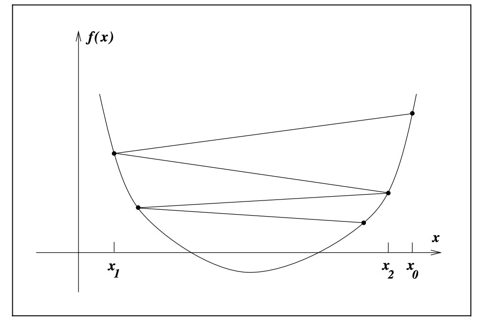
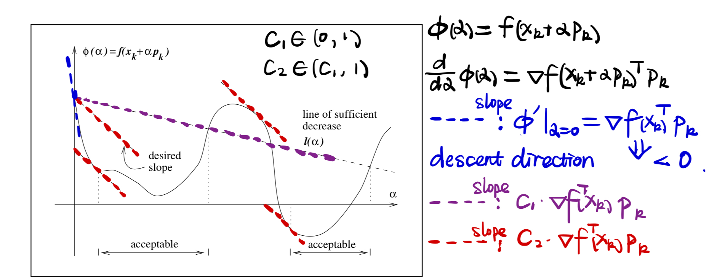

$$
\newtheorem{theorem}{Theorem}
\newtheorem{lemma}{Lemma}
$$

### Preface

The blogs are solely used to record my study of optimization methods and, as such, will not be as comprehensive or detailed as the referenced textbook,[Numerical Optimization][1]. Additionally, as a computer science major student, I aim to keep the content practical rather than abstract.

#### Main idea

Given a continuous differentiable function $f: \mathbb{R}^{n} \rightarrow \mathbb{R}$ and assume we are now at point $x_{k}$, since we want to minimize the function value, we aim to find a new point $x_{k+1}$, s.t., $f(x_{k+1}) < f(x_{k})$. But how to find this new point? Line search tells us to walk along the direction $p_{k} \in \mathbb{R}^{n}$ for a small step $\alpha_{k} \in \mathbb{R}$. Therefore, the iteration of line search is given by

$$
\begin{aligned}
    x_{k+1} = x_{k} + \alpha_{k}p_{k}.
\end{aligned}
$$

Another question arises, how to determine the search direction $p_{k}$. According to Taylor's Theorem,

$$
\begin{aligned}
    f(x + \alpha p) = f(x) + \alpha \nabla f(x)^{\top}p + \frac{1}{2}\left(\alpha p\right)^{\top}\nabla^{2} f(x + t\alpha p)\left(\alpha p\right), \text{for some } t \in [0, 1].
\end{aligned}
$$

Since the quadratic term ($\frac{1}{2}\alpha^{2}p^{\top}\nabla^{2} f(x + t\alpha p)p$) about $\alpha$ approaches $0$ faster than the linear term ($o(\alpha)$), we may focus on the linear term when $\alpha$ is sufficiently small. To decrease the function value, 

$$
\nabla f(x)^{\top}p < 0
$$

is sufficient. And such directions $p$ are so-called descent direction. There're some popular choices of $p$, such as $-\nabla f(x)$ used in steepest descent, $-\mathbf{B}^{-1}\nabla f(x)$ where $\mathbf{B}$ is a positive definite (p.d.f) matrix. Notice that Newton direction ($-\mathbf{H}^{-1}\nabla f(x)$) is not guaranteed to be a descent direction since the Hessian matrix $\mathbf{H}$ may not be p.d.f.

#### The Wolfe condition

Unfortunately, the naive idea that $f(x_{k+1}) < f(x_{k})$ has some issues. For example, in the image below, we design a sequence of iterates $\{x_{k}\}$ for which $f(x_{k}) = 5 / k, k=0,1,\cdots$. Even though each iterate yields decrease($f(x_{0}) > f(x_{1}) > f(x_{2})$), this sequence will not lead us to the minimum which is obviousily less than $0$.

To overcome the aforementioned problems, wolf condition are proposed,

$$
\begin{cases}
f(x_{k} + \alpha p_{k}) \le f(x_{k}) + c_{1}\alpha \nabla f_{k}^{\top}p_{k}, \text{for } c_{1} \in (0, 1) [\text{Armijo Rule}]\\
\nabla f(x_{k} + \alpha p_{k})^{\top} p_{k} \ge c_{2}\nabla f_{k}^{\top}p_{k}, \text{for } c_{2} \in (c_{1}, 1).
\end{cases}
$$

Don't be scared by these conditions, a picture can vividly demonstrate what these conditions are telling about. But before diving into the picture, let's firstly recap the basic knowledge of directional derivative.

$$
\begin{array}{ll}
\frac{d}{d \alpha}f(x_{k} + \alpha p_{k}) & = \frac{f(x_{k} + (\alpha + d \alpha)p_{k}) - f(x_{k} + \alpha p_{k})}{d \alpha}    \\
& = \frac{f(x_{k} + \alpha p_{k}) + \nabla f(x_{k} + \alpha p_{k})^{\top}\underbrace{p_{k}d\alpha}_{\text{small perturbation}} - f(x_{k} + \alpha p_{k})}{d\alpha}  \\
& = \nabla f(x_{k} + \alpha p_{k})^{\top}p_{k}
\end{array}
$$

test theorem 3

$$
\begin{theorem}
For any integers \(a\) and \(b\), if \(a + b\) is even, then \(a\) and \(b\) have the same parity.
\end{theorem}
$$

[1]: https://www.math.uci.edu/~qnie/Publications/NumericalOptimization.pdf
