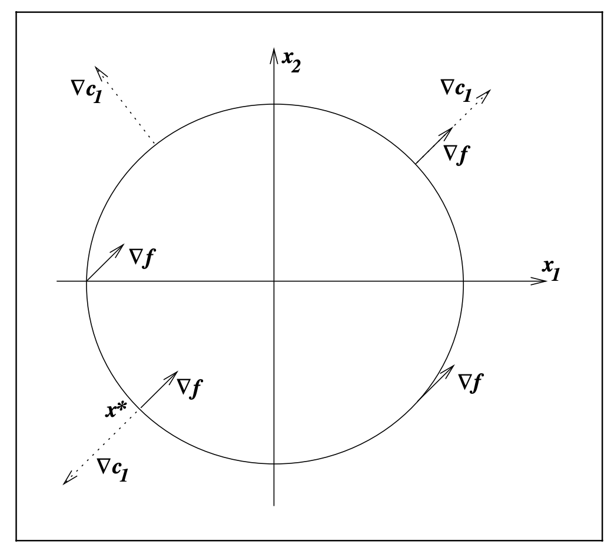
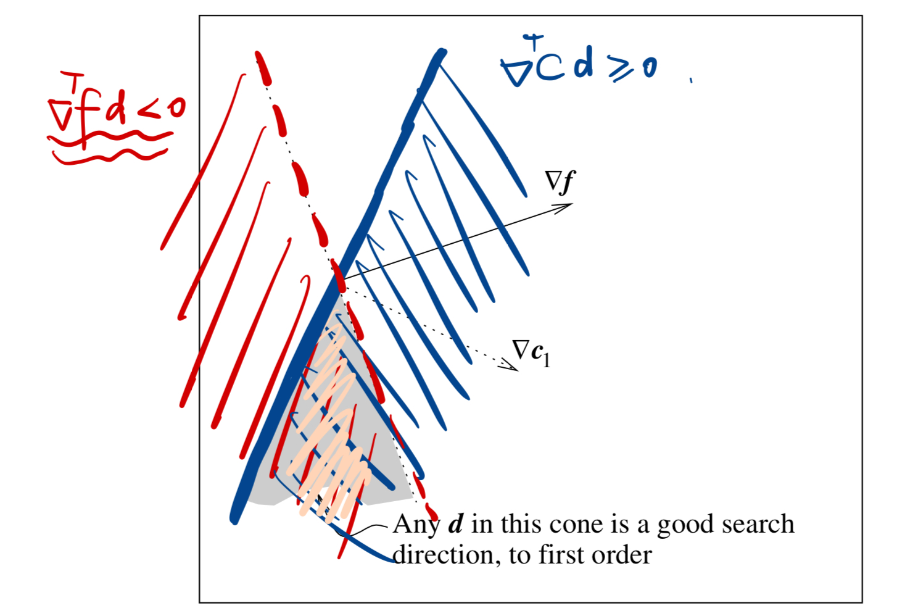

### Preface

I believe I have some understanding of constrained optimization problems before exploring Chapter 12 of [Numerical Optimization][1]. For instance, during my undergraduate studies, my Calculus professor taught me the Lagrange multiplier method for tackling such problems. Additionally, through advanced machine learning and optimization courses, I learned about the penalty method and can confidently recite the Karush-Kuhn-Tucker (KKT) conditions. However, I must admit that I don’t fully grasp the deeper reasons why these methods are significant or the critical roles they play. In this blog, I will revisit these concepts, dive into their intricacies, and explore the importance of duality in constrained optimization.

### Problem formulation

In this blog, we mainly focus on the following problem,

$$
\begin{array}{cc}
    \min_{x \in \mathbb{R}^{n}} & f(x) \\
    \text{s.t.} & c_{i}(x) = 0, i \in \mathcal{E}, \\
                & c_{i}(x) \ge 0, i \in \mathcal{I},
\end{array}
$$

where $f$ and the functions $c_{i}$ are all smooth, real-valued functions on subset of $\mathbb{R}^{n}$, and $\mathcal{E}$ and $\mathcal{I}$ are finite sets of indices. Here, the $c_{i}$, $i \in \mathcal{E}$ are the equality constraints and $c_{i}$, $i \in \mathcal{I}$ are the inequality constraints. We define the feasible set $\Omega$ to be the set of points that **satisfy the constraints**.

Consequently, a simplified formulation of the problem is,

$$
\min_{x \in \Omega} ~ f(x).
$$

### Lagrangian function

I firmly believe that most readers are familiar with the structure of the Lagrangian function. Typically, we assign a multiplier to each constraint and formulate the Lagrangian by subtracting the product of each multiplier and its corresponding constraint function from the objective function, as expressed by $\mathcal{L}(x, \lambda, \mu) = f(x) - \sum_{i \in \mathcal{E}} \lambda_i c_i(x) - \sum_{i \in \mathcal{I}} \mu_i c_i(x)$. In most cases, the next step involves computing the gradient with respect to the optimization variable $x$ and setting it to zero to find the critical points. **_BUT WHY?_** 

Let's understand this with an example.

Consider

$$
\begin{array}{cc}
    \min & x_{1} + x_{2} \\
    \text{s.t.} & 2 - x_{1}^{2} - x_{2}^{2} \ge 0.
\end{array}
$$

Clearly, the feasible region is a circle and its interior as demonstrated in the following figure. Additionally, we plot the gradient of objective function $\nabla f = [1, 1]^{\top}$ and the constraint normal $\nabla c_{1} = [-2x_{1}, -2x_{2}]^{\top}$ **(The $\nabla c_{1}$ in the figure should point to the opposite direction.)**

To analyze the problem throughly, we consider two cases:

1. **Interior Minimizer:** When the minimizer lies in the interior of the feasible set $\Omega$. In this situation, if the gradient of the objective function $\nabla f \neq \mathbf{0}$, we can move in the direction of  $-\nabla f$ with a sufficiently small step to obtain a point with a lower function value while remaining feasible. Thus, for a point in the interior to be a minimizer, it must satisfy $\nabla f = \mathbf{0}$. In this case, the zero vector is parallel to any vector, including the constraint normal.

2. **Boundary Minimizer:** When the minimizer lies on the boundary of $\Omega$. In this situation, the corresponding constraint is "active," meaning the equality $c(x) = 0$ holds. Here, not all directions are feasible, as moving in certain directions may violate the constraint. To remain feasible, a small displacement $d$ must satisfy $c(x+d)\approx c(x)+\nabla c^{\top}d = \nabla c^{\top}d\ge 0$. Additionally, to improve the objective function, we require $f(x+d) \approx f(x)+\nabla f^{\top}d < f(x) \rightarrow \nabla f^{\top}d <0$. At a minimizer, no such direction $d$ should exist that satisfies both conditions simultaneously. Consequently, $\nabla f$ and $\nabla c$ must be parallel and point in the same direction (i.e., $\nabla f = \lambda \nabla c$ for some $\lambda \geq 0$). Otherwise, the two half-spaces defined by $\nabla c^{\top} d \geq 0$ and $\nabla f^{\top} d < 0$ would intersect, implying the existence of a feasible descent direction, as illustrated in the accompanying figure.

To sum up, both of the situations require that the gradient of the objective function is parallel to the constraint normal. Furthermore, multipler $\lambda$ is nonnegative, and when the constraint is **inactive** ($c_{i}(x) > 0$), the corresponding multiplier must be $0$ (complementarity slackness).

### Tagent cone and constraint qualification

### KKT conditions

### KKT conditions: proof

### Duality

[1]: https://www.math.uci.edu/~qnie/Publications/NumericalOptimization.pdf