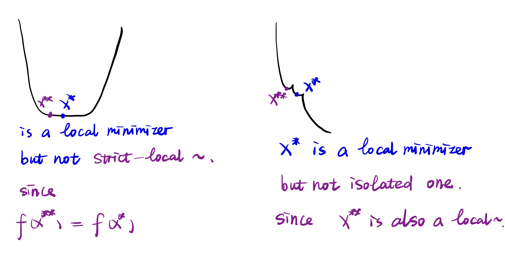

### Preface

This new chapter is based on [Optimization for Data Analysis][1].

### Solutions to Optimization Problems

Suppose that $f$ is a function mapping some domain $\mathcal{D} = \text{dom}(f) \subset \mathbb{R}^{n}$ to the real line $\mathbb{R}$. Some key definitions are defined as follow:

1. **Local Minimizer**: $x^{\ast} \in \mathcal{D}$ is a _local minimizer_ of $f$ is there is a neighborhood $\mathcal{N}$ of $x^{\ast}$ such that $f(x) \ge f(x^{\ast})$ for all $x \in \mathcal{N} \cap \mathcal{D}$.

2. **Global Minimizer**: $x^{\ast} \in \mathcal{D}$ is a _global minimizer_ of $f$ if $f(x) \ge f(x^{\ast})$ for all $x \in \mathcal{D}$.

3. **Strict Local Minimizer**: $x^{\ast} \in \mathcal{D}$ is a _strict local minimizer_ if it is a local minimizer for some neighborhood $\mathcal{N}$ of $x^{\ast}$ and, in addition, $f(x) > f(x^{\ast})$ for all $x \in \mathcal{N}$ with $x \ne x^{\ast}$.

4. **Isolated Local Minimizer**: $x^{\ast} \in \mathcal{D}$ is a _isolated local minimizer_ if there is a neighborhood $\mathcal{N}$ of $x^{\ast}$ such that $f(x) \ge f(x^{\ast})$ for all $x \in \mathcal{N} \cap \mathcal{D}$ and, in addition, $\mathcal{N}$ contains no local minimizers other than $x^{\ast}$.

5. **Unique Minimizer**: $x^{\ast}$ is the _unique minimizer_ if it is the only global minimizer.

With the aforementioned definitions, the next challenge is to determine whether a particular point is a local or global solution. Therefore, the following contents mainly focus on how to formulate these conditions.

### Taylor's Theorem

Recall some basic knowledge first:

- Integral.
  $$
  \int_{0}^{1}\frac{\partial f(x+\gamma p)}{\partial \gamma}d\gamma = f(x+\gamma p)\big|_{0}^{1} = f(x+p) - f(x).
  $$

- Directional Derivative. A comprehensive derivation can be found in [Line search](../2025-09-03-Line_Search). Here, what we should know is that $\frac{\partial f(x+\gamma p)}{\partial \gamma} = \nabla f(x+\gamma p)^{\top}p$.

#### Theorem 1

Given a _continuously differentiable_ function $f: \mathbb{R}^{n} \rightarrow \mathbb{R}$, and given $x, p \in \mathbb{R}^{n}$, we have that

$$
\begin{array}{ll}
f(x+p) & = f(x) + \int_{0}^{1}\nabla f(x+\gamma p)^{\top}pd\gamma,    \\
f(x+p) &=  f(x) + \nabla f(x+\gamma p)^{\top}p, ~ \text{some}~\gamma \in (0,1). \\
\end{array}
$$

If $f$ is _twice continuously differentiable_, we have

$$
\begin{array}{ll}
\nabla f(x+p) & = \nabla f(x) + \int_{0}^{1}\nabla^{2} f(x+\gamma p)pd\gamma,    \\
f(x+p) &=  f(x) + \nabla f(x)^{\top}p + \frac{1}{2}p^{\top}\nabla^{2} f(x+\gamma p)p, ~ \text{some}~\gamma \in (0,1). \\
\end{array}
$$

Sometimes the second equation in the _continuously differentiable_ case is referred as the mean value theorem. Using this theorem, we can conclude that

$$
f(x + p) = f(x) + \nabla^{\top} f(x)p + \mathcal{o}(\|p\|).
$$

This equation states that the function value at a nearby point can be approximated by its linearization, with an error term that is little-o of $\|\|p\|\|$. We now briefly review the notations $\mathcal{O}(\cdot)$ and $\mathcal{o}(\cdot)$.

Consider two sequences $\{\eta_k\}$ and $\{\epsilon_k\}$ with $\epsilon_k \to 0$ (or $\epsilon_k \to \infty$). We say $\eta_k = \mathcal{O}(\epsilon_k)$ if there exists a constant $M > 0$ such that $\eta_{k} \leq M \epsilon_{k}$ for all $k$ sufficiently large. In particular, if $\eta_{k} \leq \epsilon_{k}$ for all $k$, then $\eta_k = \mathcal{O}(\epsilon_k)$ with $M = 1$, so $\epsilon_k$ serves as an asymptotic upper bound for $\eta_k$. The same definition applies when $\epsilon_k \to \infty$.

On the other hand, we write $\eta_k = \mathcal{o}(\epsilon_k)$ if $\frac{\eta_k}{\epsilon_k} \to 0$ as $k \to \infty$.

We now prove the desired expansion:

$$
\begin{array}{ll}
f(x+p) & = f(x) + \nabla f(x+\gamma p)^{\top}p ~~ \text{(Mean-value theorem)}         \\
       &=  f(x) + \nabla f(x)^{\top}p +  (\nabla f(x+\gamma p) - \nabla f(x))^{\top}p \\
       &=  f(x) + \nabla f(x)^{\top}p +  \mathcal{O}((\|\nabla f(x+\gamma p) - \nabla f(x))\| \|p\|) ~~ (\text{Cauchy-Schwarz}: \langle a, b\rangle^{2} \le \|a\|^{2}\|b\|^{2})
\end{array}
$$

To obtain the $\mathcal{o}(\|\|p\|\|)$ term, consider a sequence $\{p_k\}$ with $p_k \to 0$ as $k \to \infty$. Since $\nabla f$ is continuous at $x$ (as $f$ is continuously differentiable), we have

$$
\|\nabla f(x + \gamma p_k) - \nabla f(x)\| \to 0 \quad \text{as} \quad k \to \infty.
$$

Thus, the remainder term satisfies

$$
\frac{\mathcal{O}\left(\|\nabla f(x + \gamma p_k) - \nabla f(x)\| \cdot \|p_k\|\right)}{\|p_k\|} = \mathcal{O}\left(\|\nabla f(x + \gamma p_k) - \nabla f(x)\|\right) \to 0 \quad \text{as} \quad k \to \infty.
$$

Therefore,

$$
f(x + p) = f(x) + \nabla f(x)^{\top} p + \mathcal{o}(\|p\|), \|p\| \to 0.
$$

### Lipschitz constant $L$

#### $L$-Lipschitz gradients

$$
\|\nabla f(x) - \nabla f(y)\| \le L \|x - y\|, ~~~\text{for all}~x, y \in \text{dom}(f).
$$

#### $L_{0}$-Lipschitz

$$
|f(x) - f(y)| \le L_{0} |x - y|, ~~~\text{for all}~x, y \in \text{dom}(f).
$$

We can derive some useful upper bound based on $L$-Lipschitz gradients.

#### Lemma 1

_Given an $L$-smooth function $f$, we have for any $x, y \in \text{dom}(f)$ that,_

$$
f(y) \le f(x) + \nabla f(x)^{\top}(y - x) + \frac{L}{2}\|y - x\|^{2}.
$$

That is function $f$ can be upper-bounded by a quadratic function.

#### Proof 1

$$
\begin{array}{ll}
f(y)   & = f(x) + \int_{0}^{1}\nabla f(x+\gamma (y-x))^{\top}(y-x)d\gamma          \\
f(y) - f(x) - \nabla f(x)^{\top}(y - x) &= \int_{0}^{1}\nabla f(x+\gamma (y-x))^{\top}(y-x)d\gamma - \nabla f(x)^{\top}(y - x) \\
&= \int_{0}^{1}\nabla f(x+\gamma (y-x))^{\top}(y-x)d\gamma - \int_{0}^{1} \nabla f(x)^{\top}(y - x)d\gamma \\
&= \int_{0}^{1}\nabla (f(x+\gamma (y-x)) - \nabla f(x))^{\top}(y-x)d\gamma \\
&\le \int_{0}^{1}\| \nabla (f(x+\gamma (y-x)) - \nabla f(x))\| \|(y-x)\|d\gamma ~ \text{(Cauchy-schwarz)}  \\
&\le \int_{0}^{1} L\gamma \| y-x \| \|(y-x)\|d\gamma  ~ \text{($L$-smooth)} \\
&= \frac{L}{2}\|y-x\|^{2}.
\end{array}
$$

#### Lemma 2

Suppose $f$ is twice continuously differentialble on $\mathbb{R}^{n}$. Then if $f$ is $L$-smooth, we have $\nabla^{2}f(x) \preceq LI$ for all $x$. Conversely, if $-LI \preceq \nabla^{2}f(x) \preceq LI$, then $f$ is $L$-smooth.  

#### Proof 2

According to the Taylor's theorem,

$$
f(x + \alpha p) - f(x) - \alpha \nabla f(x)^{\top} p = \frac{1}{2}\alpha^{2}p^{\top}\nabla^{2}f(x + \gamma \alpha p)p.
$$

And it's easy to obtain from last lemma that,

$$
f(x+\alpha p) - f(x) -  \alpha \nabla f(x)^{\top}p  \le \frac{L}{2}\alpha^{2}\|p\|^{2}.
$$

With the above two formulas, we get,

$$
p^{\top}\nabla^{2}f(x + \gamma \alpha p)p \le L\|p\|^{2}.
$$

Let $\alpha \downarrow 0$, we can prove all eigen values of $\nabla^{2}f(x)$ are bounded by $L$.

##### Proof 2.1

Since the Hessian matrix is symmetric, it has orthonormal eigen-decomposition,

$$
\begin{array}{ll}
p^{\top}\nabla^{2}f(x)p &= p^{\top}Q^{\top}\Sigma Qp \\
                        &= p^{\top} \begin{bmatrix}
                                    q_{1} & q_{2} & \cdots q_{n}
                                    \end{bmatrix}
                                    \Sigma
                                    \begin{bmatrix}
                                    q_{1}^{\top} \\
                                    q_{2}^{\top} \\
                                    \vdots \\
                                    q_{n}^{\top}
                                    \end{bmatrix}
                                    p               \\
                        &= \sum_{i=1}^{n} \sigma_{i} (\langle p, q_{i} \rangle)^{2}. \\
\end{array}
$$

$p$ can be represented as linear combination of the orthogonal basis,

$$
p = \sum_{i=1}^{n}a_{i}q_{i},
$$

therefore, $p^{\top}\nabla^{2}f(x)p$ reduces to $\sum_{i=1}^{n}\sigma_{i}a_{i}^{2}$. Apparently, we obtain the maximum value $\sigma_{\text{max}}a_{\text{max}}^{2}=\sigma_{\text{max}}\|\|p\|\|^{2}$ ,when $p$ is parallel to the eigenvector corresponds to the maximum eigenvalue.

Now suppose that $-LI \preceq \nabla^{2}f(x) \preceq LI$ holds, so $\|\|\nabla^{2}f(x)\|\| \le L$ for all $x$. Then we have,

$$
\begin{array}{ll}
\|\nabla f(y) - \nabla f(x)\| &= \|\int_{0}^{1}\nabla^{2}f(x + \gamma(y-x))(y-x)d\gamma\| \\
&\le \int_{0}^{1} \| \nabla^{2}f(x + \gamma(y-x))\| \|(y-x)\| d\gamma \\
&\le L\|y-x\|.
\end{array}
$$

Proof completes.

### Characterizing Minima of Smooth Functions

#### Theorem 2

(_Necessary Conditions for Smooth Unconstrained Optimization_)

- (a) _Suppose that $f$ is continuously differentiable. If $x^{\ast}$ is a local minimizer of the unconstrained problem, then $\nabla f(x^{\ast})=0$._

- (b) _Suppose that $f$ is twice continuously differentiable. If $x^{\ast}$ is a local minimizer of the unconstrained problem, then $\nabla f(x^{\ast})=0$ and $\nabla^{2}f(x^{\ast})$ is positive semidefinite._

#### Proof

We first prove (a). Suppose for contradiction that $\nabla f(x^{\ast})\neq 0$, and consider a step $-\alpha \nabla f(x^{\ast})$ away from $x^{\ast}$, where $\alpha$ is a small positive number.

By the Taylor's theorem, we can obtain,

$$
f(x^{\ast} - \alpha \nabla f(x^{\ast})) = f(x^{\ast}) - \alpha \nabla f(x^{\ast} - \gamma \alpha \nabla f(x^{\ast}))^{\top}\nabla f(x^{\ast}),
\mathrm{for~some~}\gamma \in (0, 1).
$$

Since $\nabla f$ is continuous, we know $\nabla f(x^{\ast} - \gamma \alpha \nabla f(x^{\ast})) \rightarrow \nabla f(x^{\ast})$ as $\alpha \rightarrow 0$. According to the definition of limit, for every $\epsilon > 0$, there exists a natural number $N$ such that for all $n > N$,

$$
\|\nabla f(x^{\ast} - \gamma \alpha_{n} \nabla f(x^{\ast})) - \nabla f(x^{\ast})\| < \epsilon.
$$

We can take $\epsilon = \frac{1}{2}\nabla f(x^{\ast})$ and thus $\nabla f(x^{\ast} - \gamma \alpha_{n} \nabla f(x^{\ast})) >  \frac{1}{2}\nabla f(x^{\ast})$. By the substitution, we can finally obtain,

$$
f(x^{\ast} - \alpha \nabla f(x^{\ast})) = f(x^{\ast}) - \frac{1}{2}\|\nabla f(x^{\ast})\|^{2} < f(x^{\ast}),
$$

for all positive and sufficiently small $\alpha$. Therefore, $x^{\ast}$ is not a local minimizer since there exists a point $x^{\ast} - \alpha \nabla f(x^{\ast})$ in the neighbor $\mathcal{N}$ of $x^{\ast}$ while the function value is smaller than $f(x^{\ast})$.

Then we prove (b). Similarly, suppose $\nabla^{2}f(x)$ has a negative eigenvalue. Consequently, there exists a vector $v\in \mathbb{R}^{n}$ and a positive scalar $\lambda$ such that $v^{\top}\nabla^{2}f(x^{\ast})v=-\lambda$. Then we take $p=\alpha v$ and use the second-order Taylor's theorem,

$$
f(x^{\ast}+\alpha v) = f(x^{\ast}) + \alpha \underbrace{\nabla f(x^{\ast})^{\top}v}_{first-order~condition} + \frac{1}{2}\alpha^{2}v^{\top}\nabla^{2}f(x^{\ast} + \gamma\alpha v)v \quad \text{some}~\gamma \in (0,1).
$$

Again by the continuity, $v^{\top}\nabla^{2}f(x^{\ast} + \gamma\alpha v)v < -\frac{1}{2}\lambda$ for all sufficiently small $\alpha$. Therefore,

$$
f(x^{\ast}+\alpha v) = f(x^{\ast}) - \frac{1}{4}\lambda \alpha^{2} < f(x^{\ast}),
$$

and $x^{\ast}$ is not a local minimizer.

#### Theorem 3

(_Sufficient Conditions for Smooth Unconstrained Optimization_)

Suppose that $f$ is twice continuously differentiable and that, for some $x^{\ast}$, we have $\nabla f(x^{\ast})=0$, and $\nabla^{2}f(x^{\ast})$ is positive definite. Then $x^{\ast}$ is a strict local minimizer.

#### Proof

Define a radius $\rho$ sufficiently small and positive such that the eigenvalues of $\nabla^{2}f(x^{\ast} + \gamma p)$ are bounded below by some positive number $\epsilon$, for all $p\in \mathbb{R}^{n}$ with $\|\|p\|\| \le \rho$ and all $\gamma \in (0, 1)$. Again by the second-order Taylor's theorem,

$$
\begin{array}{ll}
  f(x^{\ast} + p) &= f(x^{\ast}) + \nabla f(x^{\ast})^{\top}p +  \frac{1}{2}p^{\top}\nabla^{2}f(x^{\ast}+\gamma p)p \\
  &\ge f(x^{\ast}) + \frac{1}{2}\epsilon \|p\|^{2}.
\end{array}
$$

Thus, by setting $\mathcal{N} = \{x^{\ast}+p, \|\|p\|\|< \rho\}$, we have found a neighborhood of $x^{\ast}$ such that $f(x) > f(x^{\ast})$ for all $x\in \mathcal{N}$ with $x \neq x^{\ast}$, hence satisfying the conditions for a strict local minimizer.

Notice Theorem 3 only guarantees a *local* solution.

### Convex Sets and Functions

Convex functions play a significant role in optimization because it's easy to verify its optimality and such optima are guaranteed to be discovered within a resonable amount of computation.

#### Convex Sets

A convex set $\Omega \subset \mathbb{R}^{n}$ has the property that,

$$
x, y \in \Omega ~~ \Rightarrow (1 - \alpha)x + \alpha y \in \Omega ~~ \text{for all } ~ \alpha \in [0, 1].
$$

#### Convex Functions

The defining property of a convex function is the following,

$$
f((1 - \alpha)x + \alpha y) \le (1 - \alpha)f(x) + \alpha f(y), ~~ \text{for all} ~ x, y \in \mathbb{R}^{n}, ~ \text{all} ~ \alpha \in [0, 1].
$$

The definition(property) means the line segment connecting $(x, f(x))$ and $(y, f(y))$ lies entirely above the graph of the function $f$. In other words, the _epigraph_ of $f$, defined as,

$$
\text{epi}~f := \{(x, t) \in \mathbb{R}^{n} \times \mathbb{R} | t \ge f(x)\},
$$

is a convex set.

#### Theorem 4

Suppose that, in the general constrained optimization problem,

$$
\min_{x\in \Omega} f(x).
$$

The function $f$ is convex and the set $\Omega$ is closed and convex. We have following,

1. Any local solution to the above problem is also a global solution.

2. The set of global solutions is a convex set.

#### Proof

First property. Suppose for contradiction that $x^{\ast} \in \Omega$ is a local solution but not a global solution, so there exists a point $\bar{x} \in \Omega$ such that $f(\bar{x}) < f(x^{\ast})$. Then, by convexity, we have for any $\alpha \in [0, 1]$ that,

$$
f(x^{\ast} + \alpha (\bar{x} - x^{\ast})) \le (1 - \alpha)f(x^{\ast}) + \alpha f(\bar{x}) < f(x^{\ast}).
$$

Therefore, for a sufficiently small $\alpha$, we indeed find a point $x^{\ast} + \alpha (\bar{x} - x^{\ast}) \in \Omega$ in the neiborhood of $x^{\ast}$ such that its function value is smaller than $f(x^{\ast})$. It contradicts the definition of a local minimizer.

Second property. Given any two global solutions $x^{\ast}$ and $\bar{x}$, what we have to show is that $x^{\ast} + \alpha (\bar{x} - x^{\ast})$ is also a global minimizer. Since $x^{\ast}, \bar{x} \in \Omega$ and $\Omega$ is a convex set. Clearly, $x^{\ast} + \alpha (\bar{x} - x^{\ast}) \in \Omega$. Additionally, by the convexity of the function,

$$
f(x^{\ast} + \alpha (\bar{x} - x^{\ast})) \le (1 - \alpha)f(x^{\ast}) + \alpha f(\bar{x}) = f(x^{\ast})
$$

And since $x^{\ast}$ is the global minimizer,

$$
f(x^{\ast} + \alpha (\bar{x} - x^{\ast})) \ge f(x^{\ast}).
$$

Therefore, $f(x^{\ast} + \alpha (\bar{x} - x^{\ast})) = f(x^{\ast})$ and $x^{\ast} + \alpha (\bar{x} - x^{\ast})$ is also a global minimizer.

Apply the linear expansion property to the convex function, we will obtain,

$$
f(x + \alpha(y - x)) = f(x) + \alpha \nabla^{\top}f(x)(y-x) + o(\alpha \|y-x\|) \le (1-\alpha)f(x) + \alpha f(y),
$$

by some simple math, we can get,

$$
f(y) \ge f(x) + \nabla f(x)^{\top}(y-x) + \frac{o(\alpha \|y-x\|)}{\alpha}.
$$

Let $\alpha \downarrow 0$, the $o(1)$ term vanishs, so we finally obtain,

$$
f(y) \ge f(x) + \nabla f(x)^{\top}(y-x), ~~ \text{for any } ~ x, y \in \text{dom}(f).
$$

(Hint: $\lim_{k \rightarrow \infty} \frac{o(\alpha_{k} \|\|y-x\|\|)}{\alpha_{k}} = \lim_{k \rightarrow \infty} \frac{o(\alpha_{k} \|\|y-x\|\|)}{\alpha_{k}\|\|y-x\|\|}\|\|y-x\|\| = 0$.)

In the textbook, a more compact formula is provided. Denote $\eta_{k} = o(\alpha_{k} \|\|y-x\|\|)$, obviously, $\lim_{k\rightarrow \infty}\frac{\eta_{k}}{\alpha_{k} \|\|y-x\|\|} = \lim_{k\rightarrow \infty}\frac{\eta_{k}}{\alpha_{k}} = 0$ as $\|\|y-x\|\|$ is a constant. Thus, $\eta_{k} = o(\alpha_{k})$. And the above formulas can be simplified,

$$
f(y) \ge f(x) + \nabla f(x)^{\top}(y-x) + o(1).
$$

With this property, we can quickly conclude a useful and powerful theorem.

#### Theorem 5

Suppose that $f$ is continuously differentiable and convex. Then if $\nabla f(x^{\ast}) = 0 $, then $x^{\ast}$ is the global minimizer.

#### Proof

if we set $x = x^{\ast}$. Using this inequality together with $\nabla f(x^{\ast}) = 0$, we have, for any $y$ that

$$
f(y)\ge f(x^{\ast}) + \nabla f(x^{\ast})^{\top}(y − x^{\ast})=f(x^{\ast}),
$$

so that $x^{\ast}$ is a global minimizer.

### Strongly Convex Functions

For a function $f$ that is continuously differentiable and also convex. If there exists a value $m > 0$ such that

$$
f((1-\alpha)x+\alpha y) \le (1-\alpha)f(x)+\alpha f(y) - \frac{1}{2}m\alpha(1-\alpha)\|x-y\|_{2}^{2},
$$

for all $x$ and $y$ in the domain of $f$, we say $f$ is _strongly convex with modulus of convexity $m$_. With similar derivations, we can obtain,

$$
f(y) \ge f(x) + \nabla f(x)^{\top}(y-x) + \frac{m}{2}\|y-x\|^{2}.
$$

This inequality complements the inequality satisfied by functions with smooth gradients. When the gradients are smooth, a function can be upper-bounded by a quadratic that takes the value $f(x)$ at $x$. When the function is strongly convex, it can be _lower-bounded_ by a quadratic that takes the value $f(x)$ at $x$.

#### Theorem 6

Suppose that $f$ is continuously differentiable and strongly convex. Then if $\nabla f(x^{\ast}) = 0 $, then $x^{\ast}$ is the **unique** global minimizer of $f$.

The proof is quite simple, we can set $x=x^{\ast}$ and obtain

$$
f(y) \ge f(x^{\ast}) +\frac{m}{2}\|y-x^{\ast}\|^{2}.
$$

#### Lemma

Suppose that f is twice continuously differentiable on $\mathbb{R}^{n}$. Then
$f$ has modulus of convexity $m$ if and only if $\nabla^{2} f(x)\succeq mI$ for all $x$.

The proof is quite similar to Proof 2.

[1]: https://icourse.club/uploads/files/bd85e2cdfb9463ca73fb2245b0f6097b3803b6e6.pdf
